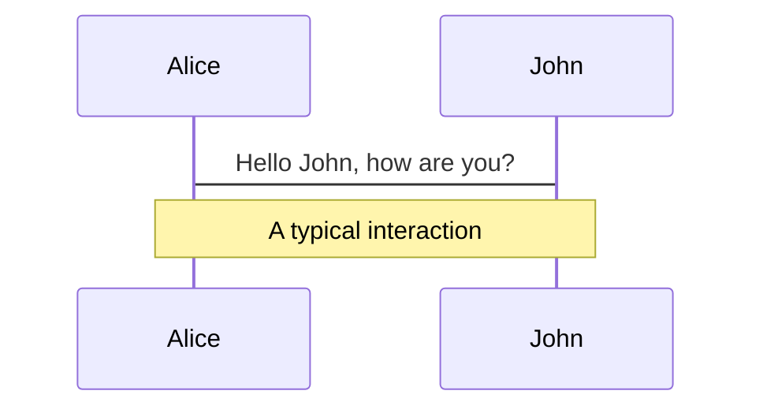
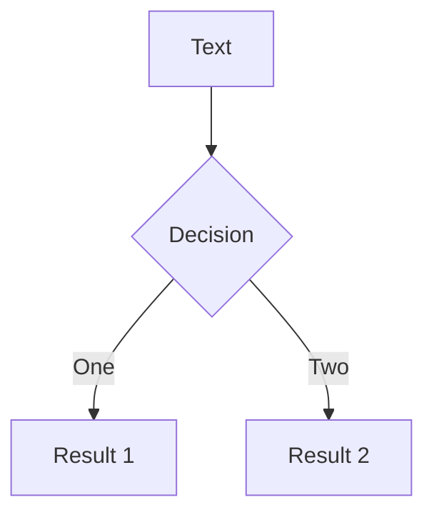
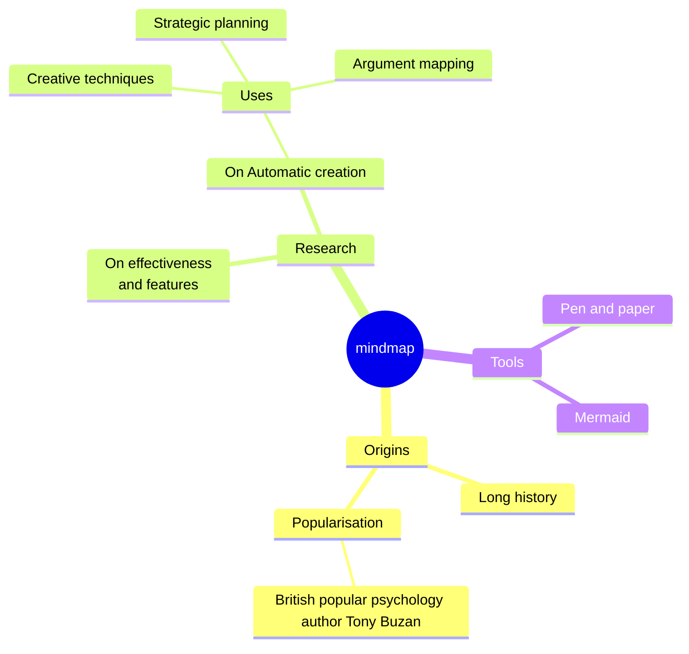
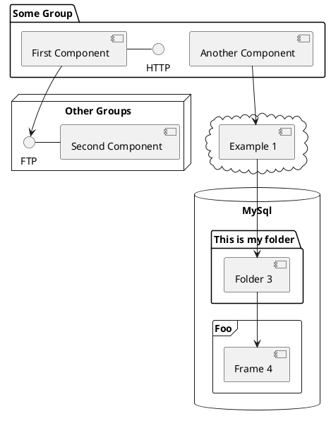

# We do talks about code

---
title: Slidev animation
---

<div class="w-full h-full flex items-center justify-center">
  <div class="relative flex flex-col items-center -mt-[50px]">
    <div class="relative w-80 h-80">
      
      
      
    </div>
    <div
      class="text-9xl text-[#2B90B6] -mt-[50px]"
      v-motion
      :initial="{ x: -160, opacity: 0 }"
      :enter="{ x: 0, opacity: 1, transition: { delay: 2000, duration: 1000 } }">
      Slidev
    </div>
  </div>
</div>

<!-- vue script setup scripts can be directly used in markdown, and will only affects current page -->
<script setup lang="ts">
const final = {
  x: 0,
  y: 0,
  rotate: 0,
  scale: 1,
  transition: {
    type: 'spring',
    damping: 10,
    stiffness: 20,
    mass: 2
  }
}
</script>

---
title: What is it?
---

::code-group

```sh [yarn]
yarn create slidev
```

```sh [pnpm]
pnpm create slidev
```

```sh [npm]
npm init slidev@latest
```

::

<div v-click class="flex" mt-20px>
  <div class="flex items-center justify-items-center w-1/2">
    
  </div>
  <div class="w-1/2">

::code-block

```md [slides.md]
---
theme: datadog
title: "DataViz Tech Talk: Slidev"
info: |
  ## Slidev presentation
  What is it and why use it

  Learn more at [Sli.dev](https://sli.dev)
mdc: true
---

# We do talks about code

---

The rest of the slides ...

---
```

::

  </div>
</div>

---

# Markdown

You can write **bold**, _italic_, and ~~striked~~ text.

- You add lists
- with multiple
- items

Ordered lists too:

1. first item
2. second item
3. third item

Inline code of course: `myFunction(someParameter)` is really convenient.

---
hideInToc: true
---

# Markdown

Let's not forget tables:

|                                                    |                             |
| -------------------------------------------------- | --------------------------- |
| <kbd>right</kbd> / <kbd>space</kbd>                | next animation or slide     |
| <kbd>left</kbd> / <kbd>shift</kbd><kbd>space</kbd> | previous animation or slide |
| <kbd>up</kbd>                                      | previous slide              |
| <kbd>down</kbd>                                    | next slide                  |

---

# Themes


https://sli.dev/resources/theme-gallery#theme-gallery  
https://sli.dev/features/eject-theme

<!--
Don't forget to show the presenter mode!

Presenter note with **bold**, *italic*, and ~~striked~~ text.

Also, HTML elements are valid:
<div class="flex w-full">
  <span style="flex-grow: 1;">Left content</span>
  <span>Right content</span>
</div>
-->

---

# Syntax coloring

<div grid grid-cols-2 gap-6>
<div flex flex-col gap-4>

```ts [greet.ts]
// Say Hello to the user
const greet = (name: string): string => {
  const message = `Hello, ${name}!`;
  return message.toUpperCase();
};
```

```py [greet.py]
# Say Hello to the user
def greet(name: str) -> str:
  message = f"Hello, {name}!"
  return message.upper()
```

</div>
<div flex flex-col gap-4>

```tsx [react]
// Title saying Hello to the user
export const Greet = ({ name }: { name: string }) => {
  const message = `Hello, ${name}!`;
  return (
    <Title className="greet__title" level={1}>
      {message.toUpperCase()}
    </Title>
  );
};
```

```css [styles.css]
/* Title saying Hello to the user */
.greet__title {
  color: #4f46e5;
  font-size: 1rem;
  font-weight: bold;
}
```

</div>
</div>

---

# Line Numbers and Line Highlighting

```ts {all|2,14|15|16-17|18|all}{lines:true,startLine:1}
import { match, P } from 'ts-pattern';

type Data =
  | { type: 'text'; content: string }
  | { type: 'img'; src: string };

type Result =
  | { type: 'ok'; data: Data }
  | { type: 'error'; error: Error };

const result: Result = ...;

const html = match(result)
  .with({ type: 'error' }, () => <p>Oups! An error occured</p>)
  .with({ type: 'ok', data: { type: 'text' } }, (res) => <p>{res.data.content}</p>)
  .with({ type: 'ok', data: { type: 'img', src: P.select() } }, (src) => )
  .exhaustive();
```

https://sli.dev/features/code-block-line-numbers.html  
https://sli.dev/features/line-highlighting

---

# Shiki Magic Move

````md magic-move
```ts
const nextState = {
  ...baseState,
  player: {
    ...baseState.player,
    inventory: [
      ...baseState.player.inventory,
      {
        id: 3,
        name: "Phoenix Feather",
        rarity: "legendary",
      },
    ],
  },
};
```

```ts
import { produce } from "immer";

const nextState = produce(baseState, (draft) => {
  draft.player.inventory = [
    ...draft.player.inventory,
    {
      id: 3,
      name: "Phoenix Feather",
      rarity: "legendary",
    },
  ];
});
```

```ts
import { produce } from "immer";

const nextState = produce(baseState, (draft) => {
  draft.player.inventory.push({
    id: 3,
    name: "Phoenix Feather",
    rarity: "legendary",
  });
});
```
````

https://sli.dev/features/shiki-magic-move

---

# Monaco Editor

```ts {monaco}
import { produce } from "immer";
import { gameState } from "./state";

const newState = produce(gameState, (draft) => {
  const potion = draft.player.inventory.find((i) => i.name === "Health Potion");
  if (potion) {
    potion.quantity -= 1;
  }
  draft.player.stats.equipment.armor.head = "Steel Helmet";
  draft.player.inventory = draft.player.inventory.filter(
    (i) => i.name !== "Old Boots",
  );
  draft.player.inventory.push({
    id: 3,
    name: "Phoenix Feather",
    rarity: "legendary",
    quantity: 1,
  });
  draft.player.stats.mana += 10;
});
```

https://sli.dev/features/monaco-editor.html  
https://microsoft.github.io/monaco-editor/

---

# Monaco Runner

```ts {monaco-run}
import { Temporal } from "temporal-polyfill";

const jsSophia11 = Temporal.ZonedDateTime.from(
  "2022-10-11T18:30:00[Europe/Paris]",
);
const jsSophia12 = Temporal.ZonedDateTime.from(
  "2023-06-15T18:17:43[Europe/Paris]",
);
const jsSophia13 = Temporal.ZonedDateTime.from(
  "2025-04-22T18:30:00[Europe/Paris]",
);

const jsSophia14 = jsSophia13.add(Temporal.Duration.from({ months: 2 }));
//console.log(jsSophia14);

//console.log(jsSophia13.since(jsSophia12)/*.toLocaleString()*/);
//console.log(jsSophia13.since(jsSophia12).round({smallestUnit: 'second'}).toLocaleString());
```

https://sli.dev/features/monaco-run.html

---
layout: iframe-unscaled-right

# the web page source
url: /components/parent-selector.html
---

# Writable Monaco Editor + iframe

<div flex flex-col gap-4>

```html
<form class="form">
  <label>
    Name
    <input type="text" />
  </label>
</form>
```

<<< ./components/parent-selector.css {monaco-write}

</div>

https://sli.dev/features/monaco-write  
https://github.com/slidevjs/slidev/issues/1920

<!--
.form:has(input:focus) {
-->

---
layout: center
---

# And many more features

---

# Table of contents

You can use the `Toc` component to generate a table of contents for your slides:

<Toc text-sm minDepth="1" maxDepth="2" columns="2" />

<div mt-10>

https://sli.dev/builtin/components#toc

</div>

---

# Clicks Animations

<div flex flex-col gap-15>

<div>

You can add `v-click` to elements to add a click animation.

<v-click>
This shows up when you click the slide.
</v-click>

</div>

<v-click>

The <span v-mark.red="3"><code>v-mark</code> directive</span>
also allows you to add
<span v-mark.circle.orange="4">inline marks</span>
, powered by [Rough Notation](https://roughnotation.com/).

</v-click>

</div>

<div mt-30>

https://sli.dev/guide/animations#click-animation  
https://roughnotation.com/

</div>

---
layout: title-two-cols-footer
---

::title::

# Embed Vue components

::left::
You can use **Vue components** directly inside your slides.

A few built-in components like `<Tweet/>` and `<Youtube/>` are provided.

<Youtube id="nleqgO38pPU" width="350" height="200" />

::right::

And adding your custom components is also super easy.

<!-- ./components/Counter.vue -->
<Counter :count="10" m="t-4" />

::footer::
https://sli.dev/builtin/components.html

---

# Diagrams

You can create diagrams / graphs from textual descriptions, directly in your Markdown.

<div class="grid grid-cols-4 gap-5 pt-4 -mb-6">









</div>

<div mt-10>

https://sli.dev/features/mermaid  
https://sli.dev/features/plantuml

</div>

---

# LaTeX

LaTeX is supported out-of-box. Powered by [KaTeX](https://katex.org/).

<div h-3 />

Inline $\sqrt{3x-1}+(1+x)^2$

Block

$$
\begin{aligned}
\nabla \cdot \vec{E} &= \frac{\rho}{\varepsilon_0} \\
\nabla \cdot \vec{B} &= 0 \\
\nabla \times \vec{E} &= -\frac{\partial\vec{B}}{\partial t} \\
\nabla \times \vec{B} &= \mu_0\vec{J} + \mu_0\varepsilon_0\frac{\partial\vec{E}}{\partial t}
\end{aligned}
$$

https://sli.dev/features/latex

---

# You can even draw!

---

# VS Code extension


---
layout: center
---

# I'll stop here, but there are more

---
layout: center
---

# Thanks!
